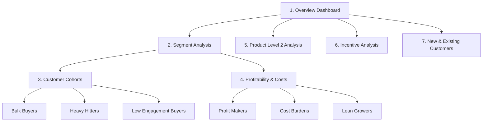

# Sales Growth & Customer Segmentation Power BI Dashboard

[](https://powerbi.microsoft.com/)
[](https://github.com/)
[](https://github.com/)

A comprehensive, interactive, and premium **Power BI Desktop Dashboard** designed to analyze sales growth, customer behaviors, logistics costs, and incentive plan effectiveness. This project transforms complex transactional data into high-impact, actionable insights using advanced DAX models, strategic cohort segmentation, and dynamic UI navigation.

---

## 📋 Table of Contents
1. [Project Overview](#-project-overview)
2. [Key Dashboard Pages & Insights](#-key-dashboard-pages--insights)
3. [Data Architecture & Schema](#-data-architecture--schema)
4. [Key Business Metrics & DAX Formulas](#-key-business-metrics--dax-formulas)
5. [Visual Design & Navigation](#-visual-design--navigation)
6. [Business Impact](#-business-impact)
7. [How to Use](#-how-to-use)

---

## 🔍 Project Overview

In multi-channel retail and distribution businesses, understanding *who* buys, *what* they buy, and *how much it costs* to serve them is critical for maximizing profit margins. This dashboard addresses these challenges by analyzing sales performance through three core lenses:
*   **Customer Segmentation:** Categorizing customers by sales volume, order diversity, and engagement levels to identify high-value cohorts and underperforming buyers.
*   **Logistics & Cost Burdens:** Breaking down variable costs (delivery, warehouse, selling, and support office expenses) to evaluate profitability by city and region.
*   **Incentive Plan Effectiveness:** Evaluating the performance of structured sales incentive models (NSI, SGI, EBI, RETAIL) to optimize promotional spending.

---

## 📊 Key Dashboard Pages & Insights

The report contains **15 interactive pages** structured to guide executives and analysts from high-level summaries down to granular customer and product details.



### 1. Executive Overview
*   **Objective:** Immediate high-level snapshot of business health.
*   **Key Visuals:** KPI cards displaying **Total Revenue**, **Total Costs**, **Total Profit**, and **Total Cities** serviced. Integrated donut charts for segment-wise sales distribution and column/bar charts showing monthly growth trends.

### 2. Segment Analysis & Cohorts
Provides deep-dive profiling of customer groups based on their spending and buying diversity.
*   **High Revenue / High Diversity (Bulk Buyers):** Customers who generate high sales volume across a wide variety of product groups.
*   **High Revenue / Low Diversity (Heavy Hitters):** High-volume buyers who focus intensely on a narrow set of product categories.
*   **Low Revenue / High Diversity (Variety Seekers):** Smaller customers who buy in tiny quantities but sample a broad range of products.
*   **Low Engagement Buyers:** Low-spend, low-frequency accounts that require reassessment or reactivation strategies.

### 3. Profitability & Cost Control
*   **Profit Makers:** Spotlights high-margin customer segments and regions. Maps and matrices isolate where profits are concentrated.
*   **Cost Burdens:** Pinpoints areas with excessive logistics costs. Visualizes the breakdown of **Delivery Cost**, **Warehouse Cost**, **Selling Cost**, and **Support Office Expenses**. Displays "Total City by Dominant Cost Type" to help optimize regional distribution.
*   **Lean Growers:** Highlights high-efficiency cities characterized by low delivery overhead and strong sales margins.

### 4. Product Level 2 Analysis
Analyzes SKU performance and classifies inventory into strategic categories using interactive action buttons:
*   *High-Impact Products* & *Premium Revenue Generators*
*   *Premium Cost Drivers* & *Profit-Leading Items*
*   *Underperforming Products* & *Minimal Profit Products*
*   *Underperforming High-Cost Products*

### 5. Incentive Analysis
Evaluates the impact of different incentive models:
*   **Incentives Tracked:** NSI (National Sales Incentive), SGI (Special Growth Incentive), EBI (Extra Bonus Incentive), and Retail programs.
*   **Key Visuals:** Pie charts representing incentive distribution by sales, "Average Sales Rate per Segment", and bar charts highlighting incentive performance across small cities.

### 6. New vs. Existing Customers
*   Tracks cohort retention by comparing purchasing patterns of newly acquired accounts against long-term partners.

---

## 🗄️ Data Architecture & Schema

The data model features a star-like tabular structure built to handle millions of rows efficiently. Key tables include:

| Table Name | Primary Purpose / Grain | Key Columns & Fields |
| :--- | :--- | :--- |
| **`product_level`** | Detailed fact table representing transaction records. | `CITY`, `CUST_NBR`, `CUST_NM`, `Customer_Segment`, `GROSS_SALES_EXTENDED_SUM`, `MENU_GROUPING`, `PIM_CLASS_DESC`, `PYRAMID_SEGMENT_DESC`, `QUANTITY_SHIPPED_SUM`, `Sales_Cost_Segment`, `TOTAL_ALLOWANCE_SUM`, `profit margin 2` |
| **`Customer_Cost_Sales_Summary`**| Aggregated customer cost performance. | `CUST_NBR`, `City`, `Dominant_Cost_Type`, `Sales_Cost_Segment2`, `Total_Allowance`, `Total_Costs`, `Total_Sales` |
| **`final_table3`** | Fact table for incentive metrics. | `GROSS_SALES_EXTENDED_SUM`, `INCENTIVE_TYPE`, `NEW_CUSTOMER`, `PIM_CLASS_DESC`, `SALES_RATE`, `TopSale Product` |
| **`Bulk_Buyer_Product_Contribution`** | Product coverage and bulk contributions. | `City_Count`, `Contribution_To_Bulk_Sales`, `PIM_CLASS_DESC`, `Product_Coverage_Tag`, `Total_Sales` |
| **`Total3`** | Aggregated cohort metrics. | `% Customers as High Engagement Buyers`, `Avg_Total_Sales`, `Customer_Segment by Sales/unique products`, `Total Sales`, `Unique Products` |
| **`customer_level`** | Granular logistics cost breakdown. | `SUM_VARIABLE DELIVERY COST`, `SUM_VARIABLE SELLING COST`, `SUM_VARIABLE SUPPORT OFFICE EXPENSE`, `SUM_VARIABLE WAREHOUSE COST` |

---

## 🧮 Key Business Metrics & DAX Formulas

Below are illustrative highlights of the analytical logic built into the Power BI model:

### 1. Customer Segment Classification
Customers are segmented dynamically using their spending vs. product diversity ratios:
```dax
Customer_Segment = 
VAR SalesRank = RANKX(ALL(product_level), [Total Sales], , DESC)
VAR ProductCount = [Unique Products]
RETURN
IF(
    [Total Sales] > 100000 && ProductCount > 15, "Bulk Buyer",
    IF([Total Sales] > 100000 && ProductCount <= 15, "Heavy Hitter",
    IF([Total Sales] <= 100000 && ProductCount > 15, "Variety Seeker", "Low Engagement")
)
```

### 2. Dominant Cost Type Identification
Isolates the highest cost driver per customer and city:
```dax
Dominant_Cost_Type = 
VAR Delivery = [SUM_VARIABLE DELIVERY COST]
VAR Warehouse = [SUM_VARIABLE WAREHOUSE COST]
VAR Selling = [SUM_VARIABLE SELLING COST]
VAR Support = [SUM_VARIABLE SUPPORT OFFICE EXPENSE]
VAR MaxCost = MAX(Delivery, MAX(Warehouse, MAX(Selling, Support)))
RETURN
SWITCH(
    TRUE(),
    MaxCost = Delivery, "Delivery",
    MaxCost = Warehouse, "Warehouse",
    MaxCost = Selling, "Selling",
    MaxCost = Support, "Support Office",
    "Mixed"
)
```

### 3. Incentive Penetration Rate
Measures customer participation in promotional incentive schemes:
```dax
% Customers as High Engagement Buyers = 
DIVIDE(
    CALCULATE(DISTINCTCOUNT(product_level[CUST_NBR]), product_level[Customer_Segment] = "High Engagement"),
    DISTINCTCOUNT(product_level[CUST_NBR]),
    0
)
```

---

## 🎨 Visual Design & Navigation

The dashboard uses modern design principles to ensure a seamless and premium user experience:
*   **Palette:** Sleek dark-mode and harmonized cool accents (blues, deep greens, and subtle red cost warnings) to drive high readability and modern aesthetics.
*   **Interactive Sidebar Navigation:** Built using customized button layouts and bookmark actions. Users can hop between the Overview, Segment Analysis, Incentive Analysis, and specific cohort lists with a single click.
*   **Visual Drill-Downs:** Geolocation maps plot sales density, and interactive scatter charts evaluate customer growth.
*   **Clean Layouts:** Focus on card groups for immediate visual feedback on key business values.

---

## 📈 Business Impact

This dashboard empowers sales and operations leaders to:
1.  **Reduce Cost-to-Serve:** Identify regions and cities where delivery costs or warehouse costs eat up margins.
2.  **Optimize Marketing Spend:** Pinpoint which incentive schemes (e.g., NSI vs SGI) yield the highest sales rate per dollar spent.
3.  **Refine Sales Strategy:** Create custom promotions for "Heavy Hitters" to cross-sell other products, or adjust minimum order values for "Low Engagement Buyers" to offset delivery costs.
4.  **Inventory Control:** Recognize underperforming products that have premium cost drivers and low sales margins.

---

## ⚙️ How to Use

### Prerequisites
*   [Power BI Desktop](https://powerbi.microsoft.com/desktop/) (June 2024 or later recommended).
*   Access to the underlying database (Excel sheets, SQL Server, or CSV data models).

### Instructions
1.  Clone this repository or download the `.pbix` file.
    ```bash
    git clone https://github.com/your-username/sales-growth-analysis-dashboard.git
    ```
2.  Open **`Sales_Growth_Analysis_Dashboard.pbix`** in Power BI Desktop.
3.  To refresh the data, navigate to the **Home** tab and click **Refresh** (adjust data source settings/file pathways if needed).
4.  Use the sidebar buttons on the left or the main menu on the **Overview** page to navigate through the pages.

---
*Developed by [Lekhya](https://github.com/your-username) - Transforming raw data into high-value strategic growth metrics.*
